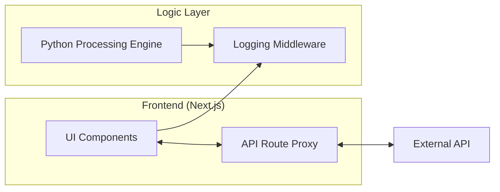

# Campus Notification & Priority System

This document provides a comprehensive overview of the architecture, technical logic, and setup for the Priority Notification System.

## Project Structure
The system is organized into three core modules, managed via npm workspaces for seamless integration.

- **Frontend (`notification_app_fe`)**: Next.js 15+ App Router interface.
- **Backend (`notification_app_be`)**: Python-based priority processing engine.
- **Middleware (`logging_middleware`)**: Standalone TypeScript logging package.

## Priority Scoring Engine
The core of the system is the priority calculation, which evaluates notifications based on a composite key:

1.  **Primary Key (Weight)**:
    - Placement: 3 (High - Career Impact)
    - Result: 2 (Medium - Academic)
    - Event: 1 (Low - General)
2.  **Secondary Key (Timestamp)**: Used for tie-breaking when weights are identical.

### Efficiency Analysis
To maintain the Top-N notifications efficiently from a stream, the system utilizes a Min-Heap.

| Method | Time Complexity | Space Complexity | Status |
| :--- | :--- | :--- | :--- |
| **Full Sort** | $O(M \log M)$ | $O(M)$ | Inefficient for large datasets. |
| **Min-Heap** | $O(M \log N)$ | $O(N)$ | **Optimal** for Top-N extraction. |

## Service Communication
The system follows a Backend-for-Frontend (BFF) pattern to ensure security and efficient data transformation.



## Authentication & Resilience
- **Authorization**: API interactions use Bearer Token headers.
- **Fallback Mechanism**: Both backend and frontend routes implement automated failover to mock datasets if external services are unreachable.
- **State Management**: Read/Unread statuses are persisted locally via React Context and localStorage.

## UI/UX Specifications
The system features a **Premium Light Industrial** design:
- **Clean Aesthetics**: Uses a #f8fafc slate background with white elevation cards.
- **Glassmorphism**: Sticky navigation header with 20px frosted glass blur.
- **Micro-interactions**: Staggered card animations (40ms offset) and pulsing unread indicators.
- **Visual Cues**: Color-coded badges for categories and explicit priority ranking (1-3).

## Setup & Execution

### 1. Unified Installation
Run this from the root directory to link all workspace packages:
```powershell
npm install
```

### 2. Frontend Development
```powershell
cd notification_app_fe
npm run dev
```
Navigate to `http://localhost:3000` to view the application.

### 3. Backend Logic Verification
```powershell
python notification_app_be/main.py
```

---

*Note: This system is designed for high scalability, maintaining a constant memory overhead of just O(N) regardless of the total notification volume.*
